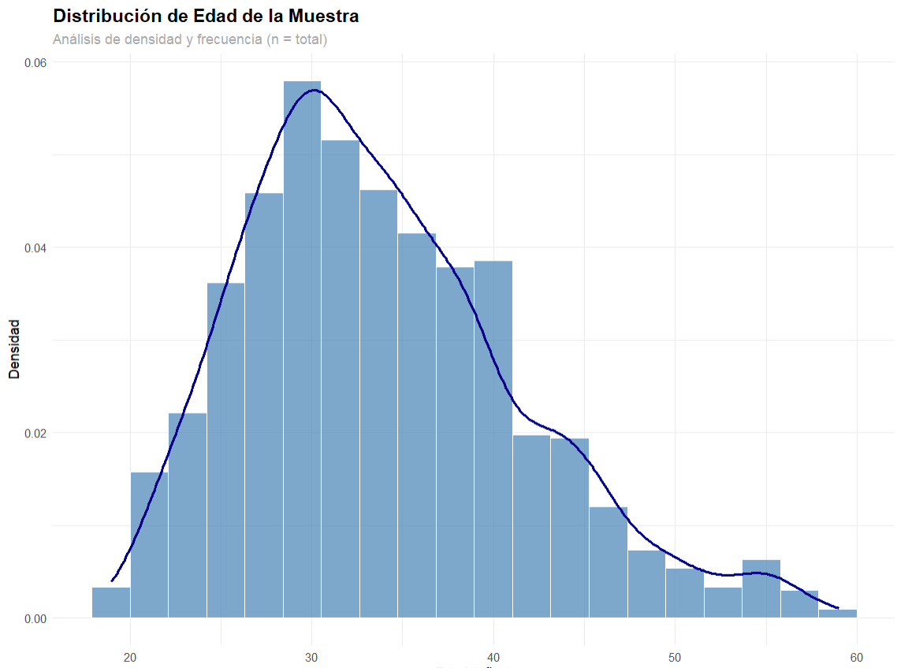
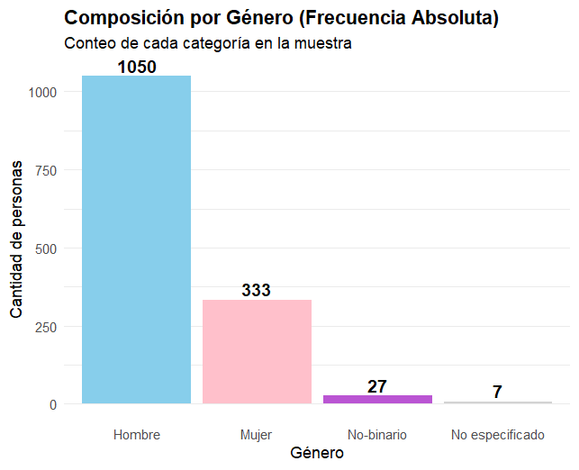
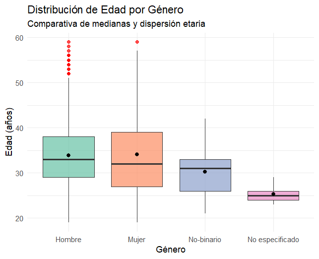

Mental Health in Tech: Investigacion exploratoria centrada en la salud mental en el trabajo

Esta simulacion analiza la prevalencia y los determinantes de la salud mental (específicamente la depresión) en trabajadores del sector IT, utilizando el dataset de OSMI. El objetivo es transformar datos crudos en insights accionables para la gestión de Recursos Humanos.
Tecnologías y Metodologías

    Lenguaje: R (tidyverse, ggplot2, vcd, stats).

    Estadística Inferencial: Test de Chi-cuadrado de Pearson, Test Exacto de Fisher, Coeficiente V de Cramer.

    Modelado: Regresión Logística Binomial para predicción de riesgo.

    Visualización: Mapas de calor (Heatmaps) de asociación y Boxplots de comorbilidad normalizados.

Hallazgos Clave 

<<<<<<< HEAD
    Brecha de Género: Se confirmó una asociación significativa (p<0.001) entre el género y la depresión. Las mujeres presentan una mayor carga diagnóstica.
	 Dashboard -> https://jotabusconi.shinyapps.io/inferencia_chi2/
=======
    Brecha de Género: Se confirmó una asociación significativa (p<0.001) entre el género y la depresión. 
	Las mujeres presentan una mayor carga diagnóstica.
	
>>>>>>> 1df9c7d2d9eff38cbad386faf1e0070cbe1a3d81

    Predictores de Comportamiento: La búsqueda de tratamiento resultó ser un predictor más robusto de salud mental que el diagnóstico profesional formal, sugiriendo que la   proactividad del empleado es un síntoma crítico.

                 Variable	Coeficiente (Estimate)	P-value	Significancia
                 Búsqueda de Tratamiento	1.15	0.00035	Alta ()*
                 Diagnóstico Profesional	0.17	0.58540	No significativa

Por qué la Búsqueda de Tratamiento es un predictor más robusto? 
Mientras que el diagnóstico profesional no resultó significativo en el modelo (p>0.05), la búsqueda activa de tratamiento mostró una relación poderosa. 
Esto indica que la conducta de pedir ayuda es el síntoma más sensible y el predictor más temprano de un cuadro depresivo, incluso antes de que el sistema de salud formalice la patología.

El análisis permite al area de Recursos Humanos:

    Diseñar programas de asistencia con foco en la depresion y con perspectiva de género.

   

Por otra parte, la asociacion entre genero y ansiedad presentó un (p>0.05) demostrando que no existe una asociacion significativa entre estas variables.

ANALISIS DESCRIPTIVO DE LA MUESTRA

DASHBOARD - > https://jotabusconi.shinyapps.io/mental_health/

Distribucion de Edades

La distribución de la muestra se caracteriza por una marcada concentración en el rango de los 25 a 35 años, donde la densidad alcanza su punto máximo, indicando que el perfil predominante es el de adultos jóvenes. 
El gráfico presenta una asimetría positiva o sesgo a la derecha, evidenciada por una "cola" que se extiende hacia las edades más avanzadas, lo que muestra una frecuencia decreciente a medida que aumenta la edad de los participantes. 
A través del histograma y la curva de densidad suavizada, se observa que, si bien la base de la muestra es joven, existe una dispersión que abarca hasta los 60 años, aunque con una representatividad significativamente menor en esos estratos superiores.

Frecuencias absolutas por genero

La composición de la muestra por género presenta una distribución que permite identificar la representatividad de cada categoría dentro del estudio a través de su frecuencia absoluta. El gráfico de barras visualiza el volumen de participantes segmentado por identidad de género, destacando la proporción de hombres, mujeres y otras identidades, lo que garantiza la transparencia sobre la diversidad de la base de datos analizada. La utilización de una codificación cromática diferenciada facilita la distinción inmediata de los grupos, mientras que la inclusión de etiquetas de conteo directo sobre cada barra asegura una interpretación precisa de las magnitudes sin necesidad de recurrir al eje vertical.

La muestra se caracteriza por una marcada prevalencia del género masculino (n>1000) y una estructura etaria joven-adulta concentrada principalmente entre los 25 y 35 años, con una mediana transversal de 33 años. Si bien la mayoría de los perfiles se desempeñan bajo relación de dependencia, el análisis de dispersión revela que la modalidad de trabajo independiente se adopta de forma heterogénea en todo el espectro generacional, sin estar condicionada estrictamente por el seniority o la edad avanzada. Aunque los grupos mantienen tendencias centrales similares, el segmento masculino presenta una mayor variabilidad y presencia de valores atípicos en edades superiores (50-60 años) en comparación con los rangos más compactos observados en identidades femeninas y no-binarias.

ESTADO CLINICO - descripcion de la muestra

DASHBOARD -> https://jotabusconi.shinyapps.io/mental_health-frecuencia-diagnosticos/

La muestra presenta una alta prevalencia de trastornos de salud mental, con una concentración predominante de casos de depresión (407) y ansiedad (341), que se posicionan como las condiciones más reportadas. En una escala menor, se observa la incidencia de TDAH (120) y estrés postraumático (70). Al desglosar por género, el grupo de hombres lidera la frecuencia absoluta en todas las categorías (destacando 242 casos de depresión y 212 de ansiedad), una tendencia que guarda relación directa con el volumen mayoritario de participantes masculinos en la muestra total, seguido por el grupo de mujeres y, en proporciones mínimas, por identidades no-binarias y no especificadas.

	                 trastorno
	genero               ansiedad  depresion  estres pt tdah
  	Hombre               212       242        36     77
  	Mujer                114       144        28     39
  	No-binario            13        16         4     2
  	No especificado        2         5         2     2

